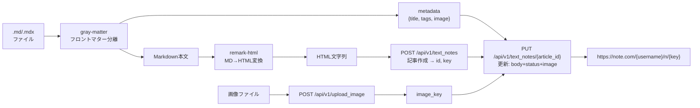

# 技術設計書 - note-md-publisher

## 1. 要件トレーサビリティマトリックス

| 要件ID | 要件内容 | 設計項目 | 既存資産 | 新規理由 |
|--------|---------|---------|---------|---------|
| REQ-001 | note.comログインとCookie取得 | AuthModule | ❌新規 | note.com固有のログインフロー |
| REQ-002 | Cookie永続化 | AuthModule（loadCookies/saveCookies） | ❌新規 | セッション管理 |
| REQ-003 | MD/MDXファイル読み込み | ContentLoader | ❌新規 | フロントマター解析+MDX対応 |
| REQ-004 | MD→HTML変換 | MarkdownConverter | ❌新規 | note.com APIはHTML形式を受け付ける |
| REQ-005 | 記事の下書き保存 | NoteAPIClient | ❌新規 | 非公式APIラッパー |
| REQ-006 | 即時公開オプション | NoteAPIClient | ❌新規 | REQ-005と同一モジュール |
| REQ-007 | ヘッダー画像アップロード | ImageUploader | ❌新規 | note.com画像API |
| REQ-008 | パス指定入力 | SKILL.md + publish.mjs | ❌新規 | スキル定義 |
| REQ-009 | フロントマターメタ情報 | ContentLoader | ❌新規 | REQ-003と同一モジュール |
| NFR-001 | ポータビリティ | §5 技術スタック | - | Node.js 18+, ESM, 最小依存 |
| NFR-002 | セキュリティ | §10 セキュリティ設計 | - | .env管理, Cookie権限, .gitignore |
| NFR-003 | エラーハンドリング | NoteAPIClient + AuthModule | - | リトライ, 再ログイン, エラーメッセージ |
| NFR-004 | 非公式API依存のリスク管理 | §3 API仕様 + NoteAPIClient | - | レート制限, レスポンス検証 |
| NFR-005 | テスト戦略 | §9 テスト戦略 | - | node:test, unit + contract |
| CON-001 | 非公式API依存 | §3 API仕様 | - | API仕様変更リスク |
| CON-002 | 配布形態 | SKILL.md | - | npx skills add 対応 |
| CON-003 | note.com固有の制約 | §3.9 本文HTML形式 | - | フォーマット・サイズ制限 |
| ASM-001 | 実行環境 | §5 技術スタック | - | Node.js 18+前提 |
| ASM-002 | note.comアカウント | §3.2 認証 | - | メール+パスワードログイン前提 |
| ASM-003 | 環境設定 | §7.4 環境変数 | - | .env設定前提 |

## 2. 参考資料

本設計は以下のOSS・記事から得られたAPI仕様に基づく。

| 出典 | 内容 |
|------|------|
| [taku_sid記事](https://note.com/taku_sid/n/n1b1b7894e28f) | Selenium + 非公式APIで記事を下書き保存する完全実装例。API呼び出しのリクエスト/レスポンス構造が判明 |
| [えっぐらす記事](https://note.com/ego_station/n/n1a0b26f944f4) | note API 非公式一覧表。記事・ユーザー・マガジン・カテゴリ等のエンドポイント網羅 |
| [NoteClient (OSS)](https://github.com/Mr-SuperInsane/NoteClient) | Python製UI自動化ライブラリ。Seleniumでnote.comのエディタを直接操作するアプローチ（本設計では不採用） |

## 3. note.com 非公式API仕様

### 3.1 ベースURL

```
https://note.com/api
```

### 3.2 認証

Cookie認証。Webブラウザでログイン後に取得されるセッションCookieをHTTPヘッダーに付与する。

- ログインURL: `https://note.com/login`
- ログインフォーム要素:
  - メールアドレス: `#email`（id属性）
  - パスワード: `#password`（id属性）
  - ログインボタン: `getByRole('button', { name: 'ログイン' })`（type="button"、初期状態disabled）
- ログイン後リダイレクト: `?redirectPath=%2F` でトップページへ

### 3.3 共通ヘッダー

```
Content-Type: application/json
User-Agent: Mozilla/5.0 (Windows NT 10.0; Win64; x64) AppleWebKit/537.36
X-Requested-With: XMLHttpRequest
Cookie: _note_session_v5=<セッションCookie値>
```

**注意**: `X-Requested-With: XMLHttpRequest` ヘッダーはPOST/PUT操作に必須。

### 3.4 記事関連API

#### 記事作成（Step 1）

```
POST /api/v1/text_notes

Request Body:
{
  "body": "<HTML形式の本文>",
  "name": "記事タイトル",
  "template_key": null
}

Response (201):
{
  "data": {
    "id": 12345678,          // 記事ID（数値）
    "key": "n1a2b3c4d5e6"   // 記事キー（URL用）
  }
}
```

#### 記事更新・下書き保存（Step 2）

```
POST /api/v1/text_notes/draft_save?id={article_id}&is_temp_saved=false

Request Body:
{
  "body": "<HTML形式の本文>",
  "name": "記事タイトル",
  "status": "draft",                        // "draft" or "published"
  "eyecatch_image_src": "<image_url>"       // 画像URL（任意）
}

Response (201):
{
  "data": { "result": true, "updated_at": "..." }
}
```

**注意**: 旧エンドポイント `PUT /api/v1/text_notes/{article_id}` は422を返す（廃止済み）。

#### 記事詳細取得

```
GET /api/v3/notes/{note_key}
```

### 3.5 画像API

#### アイキャッチ画像アップロード

```
POST /api/v1/image_upload/note_eyecatch

Request:
  Content-Type: multipart/form-data
  Body: { file: <画像バイナリ>, note_id: <記事ID> }

Response (201):
{
  "data": {
    "url": "<image_url>"    // eyecatch_image_src に使用
  }
}
```

**注意**: `note_id` は必須。記事作成（Step 1）後に取得したIDを使用する。
旧エンドポイント `POST /api/v1/upload_image` は404を返す（廃止済み）。

- 推奨サイズ: 10MB以下
- 対応形式: JPEG, PNG, GIF

### 3.6 ユーザー関連API

```
GET /api/v2/creators/{username}         // ユーザー詳細
GET /api/v2/creators/info/contents      // ユーザーの記事一覧
```

Cookie有効性の検証に `GET /api/v2/creators/{username}` を利用する。

### 3.7 投稿フロー（2ステップ）

```mermaid
sequenceDiagram
    participant Client
    participant Note as note.com API

    Note->>Note: 認証済みCookie

    Client->>Note: POST /api/v1/text_notes
    Note-->>Client: { data: { id, key } }

    opt 画像アップロード
        Client->>Note: POST /api/v1/upload_image (multipart)
        Note-->>Client: { data: { key, url } }
    end

    Client->>Note: PUT /api/v1/text_notes/{article_id}
    Note->>Note: body + status + eyecatch_image_key
    Note-->>Client: 200 OK
```

**重要**: 記事投稿は2ステップ。Step 1 で記事を作成し（IDを取得）、Step 2 で本文・ステータス・画像を更新する。

### 3.8 エラーコードと対処

| コード | 意味 | 対処 |
|--------|------|------|
| 401 | 認証エラー（Cookie期限切れ） | 再ログインしてCookieを更新 |
| 400 | リクエストボディ不正 | HTMLエスケープ処理を確認 |
| 429 | レート制限 | 1分に10リクエスト以下に抑える |

### 3.9 本文のHTML形式

note.com APIの `body` フィールドは**HTML文字列**を受け付ける。Markdownではない。

```python
# taku_sid記事のmarkdown_to_html()から判明した形式:
### h3     → <h3>見出し</h3>
## h2      → <h2>見出し</h2>
# h1       → <h1>見出し</h1>
- リスト    → <li>項目</li>
**太字**   → <strong>太字</strong>
*斜体*     → <em>斜体</em>
```code```  → <pre><code>コード</code></pre>
段落        → <p>テキスト</p>（段落ごとに<p>で囲む）
```

## 4. アーキテクチャ概要

### 4.1 システム構成図

```mermaid
graph TB
    subgraph "Claude Code Agent"
        SKILL[SKILL.md<br/>スキル定義]
        SKILL --> |"パス指定"| SCRIPT[scripts/publish.mjs<br/>メインスクリプト]
    end

    subgraph "Node.js スクリプト群"
        SCRIPT --> AUTH[lib/auth.mjs<br/>認証モジュール]
        SCRIPT --> LOADER[lib/content-loader.mjs<br/>コンテンツ読込]
        SCRIPT --> CONVERTER[lib/markdown-converter.mjs<br/>MD→HTML変換]
        SCRIPT --> API[lib/note-api.mjs<br/>API クライアント]
        SCRIPT --> UPLOADER[lib/image-uploader.mjs<br/>画像アップロード]
    end

    subgraph "note.com 非公式API"
        AUTH --> |"Playwright"| LOGIN[note.com/login<br/>ログインフォーム]
        AUTH --> |"GET"| VALIDATE[/api/v2/creators<br/>Cookie検証]
        UPLOADER --> |"POST multipart"| IMGAPI[/api/v1/upload_image]
        API --> |"POST"| CREATE[/api/v1/text_notes<br/>記事作成]
        API --> |"PUT"| UPDATE[/api/v1/text_notes/id<br/>記事更新]
    end

    subgraph "ローカルストレージ"
        AUTH --> |"読み書き"| COOKIE[(cookies.json)]
        LOADER --> |"読込"| MDFILE[(.md/.mdx<br/>ファイル)]
        UPLOADER --> |"読込"| IMGFILE[(画像ファイル)]
        ENV[(.env)] --> |"読込"| AUTH
    end
```

### 4.2 メインフロー（シーケンス図）

```mermaid
sequenceDiagram
    participant Agent as Claude Code Agent
    participant Script as publish.mjs
    participant Auth as auth.mjs
    participant Loader as content-loader.mjs
    participant Conv as markdown-converter.mjs
    participant Img as image-uploader.mjs
    participant API as note-api.mjs
    participant Note as note.com

    Agent->>Script: node scripts/publish.mjs <path> [options]

    Script->>Auth: authenticate()
    Auth->>Auth: loadCookies()
    alt Cookie有効
        Auth->>Note: GET /api/v2/creators/{username}
        Note-->>Auth: 200 OK（認証確認）
        Auth-->>Script: cookies
    else Cookie無効 or なし
        Auth->>Note: Playwrightでログイン（note.com/login）
        Note-->>Auth: セッションCookie
        Auth->>Auth: saveCookies()
        Auth-->>Script: cookies
    end

    Script->>Loader: loadContent(path)
    Loader->>Loader: gray-matter でフロントマター分離
    Loader-->>Script: { metadata, body, imagePath }

    Script->>Conv: convert(body)
    Note: MD→HTML変換
    Conv-->>Script: htmlContent

    Script->>API: createArticle(title, htmlContent, cookies)
    API->>Note: POST /api/v1/text_notes
    Note-->>API: { data: { id, key } }

    opt ヘッダー画像あり
        Script->>Img: uploadImage(imagePath, cookies)
        Img->>Note: POST /api/v1/upload_image (multipart)
        Note-->>Img: { data: { key, url } }
        Img-->>Script: imageKey
    end

    Script->>API: updateArticle(id, htmlContent, title, status, imageKey, cookies)
    API->>Note: PUT /api/v1/text_notes/{article_id}
    Note-->>API: 200 OK

    Script-->>Agent: 成功: https://note.com/{username}/n/{key}
```

## 5. 技術スタック

| カテゴリ | 技術 | バージョン | 選定理由 |
|---------|------|-----------|---------|
| ランタイム | Node.js | >=18.0 | Claude Codeユーザーに確実に存在 |
| ブラウザ自動化 | Playwright | latest | ヘッドレスログイン。`npx playwright install` で完結 |
| MD→HTML変換 | unified + remark-parse + remark-html | latest | MDX対応、remark-htmlでHTML出力が容易 |
| フロントマター | gray-matter | latest | YAML解析の定番。skills CLIでも採用 |
| HTTP | Node.js fetch API | built-in | Node.js 18+標準。追加依存なし |
| モジュール形式 | ESM (.mjs) | - | モダンなNode.js標準 |

## 6. モジュール・クラス設計

### [REQ-001, REQ-002] AuthModule（lib/auth.mjs）

> 📌 要件: Playwrightでnote.comにログインし、Cookieを取得・永続化する

```
export async function authenticate(): Promise<CookieDict>
  - loadCookies() でファイルからCookie読込を試行
  - validateCookies() でCookie有効性を確認
  - 有効ならそのまま返す
  - 無効なら loginWithPlaywright() でブラウザログイン
  - 取得したCookieを saveCookies() で保存
  - CookieDict を返す（{ name: value, ... } 形式）

internal function loginWithPlaywright(): Promise<CookieDict>
  - .env から NOTE_EMAIL, NOTE_PASSWORD を読込
  - Playwright (chromium, headless: true) を起動
  - https://note.com/login にアクセス
  - input[name="email"] にメール入力
  - input[name="password"] にパスワード入力
  - button[type="submit"] をクリック
  - ログイン完了を待機（URLが /login 以外に遷移）
  - browser.context().cookies() でCookieを取得
  - { name: value } 形式に変換して返す

internal function loadCookies(): CookieDict | null
  - ~/.config/note-md-publisher/cookies.json を読込
  - savedAt からの経過時間チェック（24時間超で無効）
  - 有効なら CookieDict を返す、無効なら null

internal function saveCookies(cookies: CookieDict, rawCookies: PlaywrightCookie[]): void
  - ~/.config/note-md-publisher/cookies.json に保存
  - ファイルパーミッション 0600 に設定

internal function validateCookies(cookies: CookieDict): Promise<boolean>
  - .env から NOTE_USERNAME を読込
  - GET https://note.com/api/v2/creators/{username} にリクエスト
  - 200 が返ればtrue、401等ならfalse

type CookieDict = Record<string, string>  // { cookie_name: cookie_value }
```

### [REQ-003, REQ-009] ContentLoader（lib/content-loader.mjs）

> 📌 要件: MD/MDXファイルを読み込み、フロントマターとメタ情報を解析する

```
export async function loadContent(inputPath: string): Promise<ContentResult>
  - inputPath がファイルかディレクトリかを判定
  - ファイル → 直接読込
  - ディレクトリ → *.md, *.mdx を検出（最初の1ファイル）
  - gray-matter でフロントマターを解析
  - ContentResult を返す

type ContentResult = {
  metadata: {
    title: string       // フロントマターまたはh1から抽出
    tags: string[]      // フロントマターから
    publish: boolean    // フロントマターまたはフラグから
    imagePath: string | null  // フロントマターまたはオプションから（絶対パスに解決済み）
  }
  body: string          // フロントマターを除いたMarkdown本文
  filePath: string      // 元ファイルのパス
}
```

### [REQ-004] MarkdownConverter（lib/markdown-converter.mjs）

> 📌 要件: Markdownをnote.com APIが受け付けるHTML文字列に変換する

```
export function convert(markdown: string): string
  - unified + remark-parse でMarkdown ASTに変換
  - MDX固有要素（import, JSX）をフィルタ
  - remark-html でHTMLに変換
  - HTML文字列を返す

変換マッピング（MD→HTML）:
  # h1       → <h1>見出し</h1>
  ## h2      → <h2>見出し</h2>
  ### h3     → <h3>見出し</h3>
  段落        → <p>テキスト</p>
  **bold**   → <strong>太字</strong>
  *italic*   → <em>斜体</em>
  [text](url) → <a href="url">text</a>
  - item     → <ul><li>item</li></ul>
  1. item    → <ol><li>item</li></ol>
  ```code``` → <pre><code>code</code></pre>
  > quote    → <blockquote>引用</blockquote>
  ---        → <hr>
  → スキップ（本文中画像はスコープ外）

注意: remark-html がほぼそのまま使えるため、カスタム変換は最小限。
MDX固有要素（import文、JSXコンポーネント）のフィルタのみ独自実装。
```

### [REQ-005, REQ-006] NoteAPIClient（lib/note-api.mjs）

> 📌 要件: note.comの非公式APIで記事を投稿する（2ステップ）

```
export async function postArticle(params: PostParams): Promise<PostResult>
  Step 1: createArticle()
    - POST https://note.com/api/v1/text_notes
    - Body: { body: htmlContent, name: title, template_key: null }
    - レスポンスから articleId（data.id）, articleKey（data.key）を取得

  Step 2: updateArticle()
    - PUT https://note.com/api/v1/text_notes/{article_id}  // ※ JS変数 articleId の値を使用
    - Body: {
        body: htmlContent,
        name: title,
        status: "draft" | "published",
        eyecatch_image_key: imageKey || undefined
      }

  - リトライロジック（最大3回、エクスポネンシャルバックオフ）
  - レート制限: リクエスト間隔を最低1秒空ける

type PostParams = {
  htmlContent: string       // 変換済みHTML
  title: string
  tags: string[]
  imageKey: string | null   // upload_image で取得した key
  status: "draft" | "published"
  cookies: CookieDict
}

type PostResult = {
  success: boolean
  articleId: number
  articleKey: string        // URL用キー（n1a2b3c4d5e6 形式）
  noteUrl: string           // https://note.com/{username}/n/{articleKey}
  status: "draft" | "published"
}

internal function buildHeaders(cookies: CookieDict): Headers
  - Cookie ヘッダーを構築（"name1=value1; name2=value2" 形式）
  - Content-Type: application/json
  - User-Agent: Mozilla/5.0 ...
```

### [REQ-007] ImageUploader（lib/image-uploader.mjs）

> 📌 要件: ヘッダー画像をnote.comにアップロードする

```
export async function uploadImage(imagePath: string, cookies: CookieDict): Promise<ImageResult>
  - 画像ファイルを読み込む
  - ファイル形式チェック（JPEG, PNG, GIF）
  - ファイルサイズチェック（10MB以下）
  - POST https://note.com/api/v1/upload_image
  - multipart/form-data で送信（{ file: <buffer> }）
  - ImageResult を返す

type ImageResult = {
  imageKey: string    // eyecatch_image_key に使用
  imageUrl: string
}
```

### [REQ-008] メインスクリプト（scripts/publish.mjs）

> 📌 要件: パス指定で記事と画像を指定し、投稿を実行する

```
CLI引数パース:
  node scripts/publish.mjs <path> [--image <path>] [--publish] [--yes]

  <path>      : MDファイルまたはディレクトリのパス（必須）
  --image     : ヘッダー画像のパス（フロントマターの image フィールドで代替可）
  --publish   : 公開状態で投稿（デフォルトは下書き）
  --yes       : 確認プロンプトをスキップ

メインフロー:
  1. 引数パース
  2. authenticate() → cookies
  3. loadContent(path) → { metadata, body }
  4. フロントマターとCLI引数をマージ（CLIが優先）
  5. convert(body) → htmlContent
  6. 画像があれば uploadImage() → imageKey
  7. postArticle({ htmlContent, title, status, imageKey, cookies }) → result
  8. 結果出力: URL + ステータス

出力例:
  ✓ 記事を下書き保存しました
    URL: https://note.com/username/n/n1a2b3c4d5e6
    ステータス: draft

エラー出力例:
  ✗ 記事の投稿に失敗しました
    エラー: 401 Unauthorized - Cookieが期限切れです
    対処: 再度実行してください（自動的に再ログインします）
```

## 7. データ設計

### 7.1 ファイル構造

```
note-md-publisher/
├── SKILL.md                    # スキル定義（エントリポイント）
├── scripts/
│   └── publish.mjs             # メインスクリプト
├── lib/
│   ├── auth.mjs                # 認証・Cookie管理
│   ├── content-loader.mjs      # MD/MDX読込・フロントマター解析
│   ├── markdown-converter.mjs  # MD→HTML変換
│   ├── note-api.mjs            # note.com API クライアント（2ステップ投稿）
│   └── image-uploader.mjs      # 画像アップロード
├── tests/
│   ├── unit/                   # ユニットテスト（常時実行可能）
│   ├── contract/               # コントラクトテスト（要認証）
│   └── fixtures/               # テストデータ（サンプルMD、画像等）
├── package.json                # 依存関係（playwright, gray-matter, unified, remark-parse, remark-html）
├── .env.example                # 環境変数テンプレート
├── .gitignore
├── LICENSE
└── README.md
```

### 7.2 Cookie保存形式

```json
// ~/.config/note-md-publisher/cookies.json
{
  "cookies": {
    "_note_session_v5": "abc123...",
    "other_cookie": "value..."
  },
  "rawCookies": [
    {
      "name": "_note_session_v5",
      "value": "abc123...",
      "domain": ".note.com",
      "path": "/",
      "expires": 1700000000,
      "httpOnly": true,
      "secure": true
    }
  ],
  "savedAt": "2026-02-18T00:00:00.000Z"
}
```

### 7.3 フロントマター仕様

```yaml
---
title: "記事タイトル"
tags:
  - AI
  - プログラミング
image: ./header.png        # 相対パス（MDファイルからの相対）
publish: false             # true で即時公開
---
```

### 7.4 環境変数（.env）

```
NOTE_EMAIL=your-email@example.com
NOTE_PASSWORD=your-password
NOTE_USERNAME=your-note-username    # Cookie検証用
```

### 7.5 データフロー



## 8. 技術的決定事項

| 決定項目 | 選択 | 理由 |
|---------|------|------|
| ランタイム | Node.js (ESM) | Claude Codeユーザーに確実に存在。ESMでモダンな記法 |
| ブラウザ自動化 | Playwright | ヘッドレス対応、クロスプラットフォーム、`npx` で完結 |
| MD→HTML変換 | remark-html | note.com APIがHTML形式を要求するため。remarkエコシステムでMDX対応も容易 |
| HTTPクライアント | Node.js fetch | Node.js 18+標準搭載。追加依存なし |
| フロントマター | gray-matter | 軽量・安定。skills CLIでも採用 |
| モジュール形式 | .mjs (ESM) | top-level await対応、package.json不要でESM確定 |
| Cookie保存先 | ~/.config/note-md-publisher/ | XDG Base Directory準拠 |
| 投稿方式 | 非公式API（2ステップ） | taku_sid記事で実証済み。UI自動化（NoteClient方式）より高速・安定 |
| 本文形式 | HTML | API仕様により確定（Markdownではない） |

## 9. 実装ガイドライン

### SKILL.md の役割

SKILL.mdはスキルのエントリポイントとして、以下を担当する:
- ユーザー入力（パス、オプション）の受け取りとバリデーション
- `--publish` 時の確認プロンプト（AskUserQuestion）
- `node scripts/publish.mjs` の実行（Bashツール経由）
- 結果のユーザーへの表示

実際のロジック（認証、変換、API呼び出し）はすべてNode.jsスクリプト側で処理する。

### 初回セットアップ

SKILL.mdの初回実行時に以下を検出・ガイドする:
1. `package.json` の依存インストール確認（`npm install`）
2. Playwrightブラウザのインストール確認（`npx playwright install --with-deps chromium`）
3. `.env` ファイルの存在確認（なければ `.env.example` をコピー案内）

### エラーハンドリング戦略

| エラー種別 | HTTPコード | 対応 |
|-----------|-----------|------|
| .envファイル未設定 | - | メッセージ表示 + .env.example の場所を案内 |
| ログイン失敗 | - | メール/パスワードの確認を促す。3回失敗で終了 |
| Cookie期限切れ | 401 | 自動再ログインしてリトライ |
| リクエストボディ不正 | 400 | HTMLエスケープ処理を確認。エラー詳細を表示 |
| レート制限 | 429 | 待機後にリトライ。ユーザーに通知 |
| 画像アップロード失敗 | - | 画像なしで記事のみ投稿するか確認 |
| 記事投稿API失敗 | - | リトライ3回（エクスポネンシャルバックオフ）。失敗時はエラー詳細を表示 |
| API仕様変更 | - | 想定外レスポンスを検知し、明確なエラーメッセージ |
| MDパースエラー | - | 問題箇所を表示し、スキップして続行するか確認 |

### テスト戦略

テストフレームワーク: `node:test`（Node.js 18+標準搭載、追加依存なし）

本プロジェクトは非公式APIに依存するため、モックではなくコントラクトテストで仕様変更を検知する。

```
tests/
├── unit/                              # 常時実行可能（外部依存なし）
│   ├── markdown-converter.test.mjs    # MD→HTML変換ロジック
│   └── content-loader.test.mjs        # フロントマター解析
├── contract/                          # 要認証（.env必須）
│   ├── note-api.contract.test.mjs     # 記事API構造検証
│   ├── image-api.contract.test.mjs    # 画像API構造検証
│   └── README.md                      # 実行条件の説明
├── fixtures/                          # テストデータ
│   ├── sample-article.md
│   ├── sample-with-frontmatter.md
│   ├── sample-mdx.mdx
│   ├── test-image.png
│   └── expected/                      # 期待出力HTML
└── run.mjs                            # テストランナー（オプション）
```

| テスト層 | 対象 | 目的 | 実行コマンド |
|---------|------|------|-------------|
| ユニットテスト | MarkdownConverter, ContentLoader | 変換ロジックの正確性 | `node --test tests/unit/` |
| コントラクトテスト | note.com API エンドポイント | API仕様変更の早期検知 | `node --test tests/contract/` |

**設計方針**:
- **モック不使用**: 非公式APIのモックは仕様変更を隠蔽するため使わない
- **コントラクトテスト**: 実際のAPIに対してレスポンス「構造」を検証（値は検証しない）
- **クリーンアップ**: コントラクトテストで作成した記事は即座に削除（DELETE APIの存在はT002で確認。未確認の場合は代替手段を検討）
- **スキップ制御**: `.env` 未設定時はコントラクトテストをスキップ（エラーにしない）

## 10. セキュリティ設計

> 📌 要件: NFR-002（セキュリティ）

### 10.1 認証情報管理

| 対象 | 保護方法 |
|------|---------|
| メールアドレス・パスワード | `.env` ファイルで管理。コードにハードコードしない |
| `.env` ファイル | `.gitignore` に含める。リポジトリにコミットしない |
| セッションCookie | `~/.config/note-md-publisher/cookies.json` に保存 |

### 10.2 Cookieセキュリティ

- **ファイルパーミッション**: `0600`（所有者のみ読み書き可）
- **保存場所**: `~/.config/note-md-publisher/cookies.json`（XDG Base Directory準拠）
- **有効期限管理**: `savedAt` タイムスタンプで24時間超過を検出し自動再ログイン
- **検証**: `GET /api/v2/creators/{username}` で有効性を毎回確認

### 10.3 .gitignore 適用

以下のファイルを `.gitignore` に含める:
- `.env` — 認証情報
- `cookies.json` — セッションCookie
- `node_modules/` — 依存パッケージ

### 10.4 通信セキュリティ

- note.com API（`https://note.com/api`）はHTTPS通信のみ
- Cookie送信はHTTPSに限定（note.com側の `Secure` フラグに依存）

## 11. 命名規約

### 11.1 API境界と内部コードの命名ルール

| レイヤー | 規約 | 例 |
|---------|------|-----|
| note.com APIフィールド | snake_case（API仕様に準拠） | `eyecatch_image_key`, `template_key`, `data.id` |
| URLパスパラメータ | `{article_id}`, `{username}` | `PUT /api/v1/text_notes/{article_id}` |
| JavaScript内部変数・型 | camelCase | `articleId`, `articleKey`, `imageKey` |
| ファイル名 | kebab-case (.mjs) | `content-loader.mjs`, `note-api.mjs` |
| テストファイル名 | kebab-case + `.test.mjs` / `.contract.test.mjs` | `markdown-converter.test.mjs` |

### 11.2 主要概念の標準名

| 概念 | API名（snake_case） | 内部名（camelCase） | 日本語 |
|------|---------------------|---------------------|--------|
| 記事ID | `data.id` | `articleId` | 記事ID |
| 記事キー | `data.key` | `articleKey` | 記事キー |
| 画像キー | `eyecatch_image_key` | `imageKey` | 画像キー |
