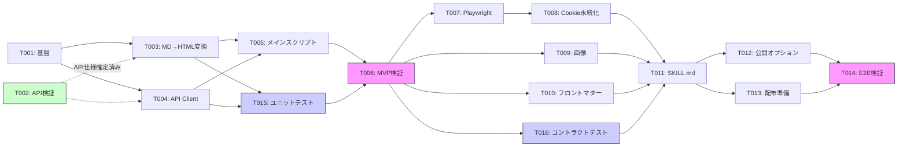

# タスクリスト - note-md-publisher

## 1. 概要

Agile戦略でMVPから段階的に構築する。
Phase 1 で最小限の投稿フローを動かし、Phase 2 以降で機能を拡充する。

### MVP定義（Phase 1 完了時点）

手動でCookieを取得し、MDファイルをnote.comに下書き保存できる状態。

## 2. タスク一覧

### Phase 1: MVP — 手動Cookie + 記事投稿

- [x] T001: プロジェクト基盤セットアップ
- [ ] T002: note.com API仕様の検証・補完
- [x] T003: [REQ-004] Markdown→HTML変換
- [x] T004: [REQ-005] 記事投稿APIクライアント（2ステップ投稿）
- [x] T005: [REQ-008] メインスクリプト（MVP版）
- [x] T015: [NFR-005] ユニットテスト ✅ 31テスト全パス
- [ ] T006: MVP動作検証

### Phase 2: 認証自動化 + 画像対応 + コントラクトテスト

- [x] T007: [REQ-001] Playwrightログイン
- [x] T008: [REQ-002] Cookie永続化
- [x] T009: [REQ-007] ヘッダー画像アップロード
- [x] T010: [REQ-003, REQ-009] フロントマター解析強化
- [x] T016: [NFR-005] APIコントラクトテスト

### Phase 3: スキル化 + 公開オプション

- [x] T011: [REQ-008] SKILL.md 作成
- [x] T012: [REQ-006] 即時公開オプション
- [x] T013: 配布準備（README、LICENSE、.env.example）
- [ ] T014: エンドツーエンド動作検証

### 優先度マッピング

| 優先度 | Phase | タスク | 根拠 |
|--------|-------|--------|------|
| P0（必須） | Phase 1 | T001, T003, T004, T005, T015, T006 | MVP実現に不可欠 |
| P0（必須） | Phase 1 | T002 | API仕様の最終確認（大部分完了済み） |
| P1（重要） | Phase 2 | T007, T008 | 認証自動化（手動Cookieからの脱却） |
| P1（重要） | Phase 2 | T016 | API仕様変更の早期検知 |
| P2（推奨） | Phase 2 | T009, T010 | 画像・フロントマター強化 |
| P2（推奨） | Phase 3 | T011, T012, T013, T014 | スキル化・配布 |

## 3. タスク詳細

### Phase 1: MVP — 手動Cookie + 記事投稿

---

### T001: プロジェクト基盤セットアップ

- 要件ID: NFR-001, NFR-002, CON-002
- 設計書参照: design.md §7.1 ファイル構造
- 依存関係: なし
- 推定時間: 1時間
- 対象ファイル:
  - `package.json`（新規）
  - `.gitignore`（新規）
  - `.env.example`（新規）
  - `scripts/publish.mjs`（スケルトン）
  - `lib/`（ディレクトリ作成）
  - `tests/unit/`（ディレクトリ作成）
  - `tests/contract/`（ディレクトリ作成）
  - `tests/fixtures/`（テスト用サンプルMDファイル配置）
- 完了条件:
  - [ ] `package.json` に依存関係（gray-matter, unified, remark-parse, remark-html）が定義されている
  - [ ] `npm install` が正常に完了する
  - [ ] `.gitignore` に `.env`, `cookies.json`, `node_modules/` が含まれる
  - [ ] `.env.example` に `NOTE_EMAIL`, `NOTE_PASSWORD`, `NOTE_USERNAME` のテンプレートがある
  - [ ] ESM (.mjs) でのモジュール読み込みが動作する
  - [ ] `tests/` ディレクトリ構造（unit/, contract/, fixtures/）が作成されている
  - [ ] `node --test tests/unit/` が実行可能な状態（空テストでもOK）

---

### T002: note.com API仕様の検証・補完

- 要件ID: CON-001
- 設計書参照: design.md §3（note.com非公式API仕様）
- 依存関係: なし
- 推定時間: 1時間
- 対象ファイル: design.md §3（必要に応じて追記）
- 完了条件:
  - [x] 記事投稿API（POST /api/v1/text_notes, PUT /api/v1/text_notes/{id}）が確定
  - [x] 画像アップロードAPI（POST /api/v1/upload_image, multipart形式）が確定
  - [x] 本文形式がHTML文字列であることが確定
  - [x] 2ステップ投稿フローが確定
  - [ ] ブラウザDevToolsで実際のリクエスト/レスポンスを照合して補完
  - [ ] ログインフォームのセレクタ（input[name="email"]等）の実環境確認
  - [ ] 記事削除API（DELETE /api/v1/text_notes/{article_id} 等）の存在確認。コントラクトテスト（T016）のクリーンアップに必要
- 並列実行: T001と同時実行可能
- 備考: API仕様の大部分はtaku_sid記事・えっぐらす記事から判明済み。実環境での検証のみ残る。DELETE APIが存在しない場合はT016のクリーンアップ方法を再検討する

---

### T003: [REQ-004] Markdown→HTML変換

- 要件ID: REQ-004
- 設計書参照: design.md §6 MarkdownConverter
- 依存関係: T001（T002はAPI形式が確定済みのため軽減）
- 推定時間: 2-3時間
- 対象ファイル: `lib/markdown-converter.mjs`（新規）
- 完了条件:
  - [ ] unified + remark-parse + remark-html でMarkdown→HTML変換が動作する
  - [ ] 見出し（h1, h2, h3）→ `<h1>`, `<h2>`, `<h3>` に変換される
  - [ ] 段落 → `
` に変換される
  - [ ] 太字・斜体 → `<strong>`, `<em>` に変換される
  - [ ] リンク → `<a href="...">` に変換される
  - [ ] 箇条書き・番号付きリスト → `<ul><li>`, `<ol><li>` に変換される
  - [ ] コードブロック → `<pre><code>` に変換される
  - [ ] 引用 → `<blockquote>` に変換される
  - [ ] MDX固有要素（import文、JSXコンポーネント）がフィルタされる
  - [ ] 簡易テスト（サンプルMD→HTML変換）がパスする
- 備考: remark-htmlがほぼそのまま使えるため、カスタム変換は最小限。推定時間を短縮

---

### T004: [REQ-005] 記事投稿APIクライアント（2ステップ投稿）

- 要件ID: REQ-005, NFR-003
- 設計書参照: design.md §6 NoteAPIClient
- 依存関係: T001（API形式は確定済み）
- 推定時間: 2-3時間
- 対象ファイル: `lib/note-api.mjs`（新規）
- 完了条件:
  - [ ] `postArticle()` 関数が2ステップで記事を投稿できる
    - Step 1: `POST /api/v1/text_notes` で記事作成（id, key取得）
    - Step 2: `PUT /api/v1/text_notes/{id}` で本文・ステータス・画像更新
  - [ ] Cookie をHTTPヘッダーに正しく設定できる（`Cookie: name1=val1; name2=val2`形式）
  - [ ] `Content-Type: application/json` と適切な`User-Agent`を設定できる
  - [ ] リトライロジック（3回、エクスポネンシャルバックオフ）が実装されている
  - [ ] リクエスト間隔を最低1秒空けるレート制限がある
  - [ ] 成功時に記事ID、キー、URLを返す
  - [ ] エラー時（401/400/429）に明確なメッセージを返す
- 並列実行: T003と同時実行可能

---

### T005: [REQ-008] メインスクリプト（MVP版）

- 要件ID: REQ-008
- 設計書参照: design.md §6 メインスクリプト
- 依存関係: T003, T004
- 推定時間: 2-3時間
- 対象ファイル: `scripts/publish.mjs`（実装）
- 完了条件:
  - [ ] `node scripts/publish.mjs <path>` でMDファイルを指定できる
  - [ ] 手動設定したCookie（.envまたは引数）で2ステップ投稿ができる
  - [ ] gray-matter でフロントマターからtitleを取得できる
  - [ ] 投稿成功時にURLを表示する
  - [ ] エラー時に原因を表示する

---

### T015: [NFR-005] ユニットテスト

- 要件ID: NFR-005
- 設計書参照: design.md §9 テスト戦略
- 依存関係: T003, T004（テスト対象モジュールの実装完了後）
- 推定時間: 2-3時間
- 対象ファイル:
  - `tests/unit/markdown-converter.test.mjs`（新規）
  - `tests/unit/content-loader.test.mjs`（新規）
  - `tests/fixtures/sample-article.md`（新規）
  - `tests/fixtures/sample-with-frontmatter.md`（新規）
  - `tests/fixtures/sample-mdx.mdx`（新規）
  - `tests/fixtures/expected/`（期待出力HTML）
- 完了条件:
  - [ ] `node:test` でテストが実行できる
  - [ ] MarkdownConverter テスト:
    - [ ] 見出し（h1-h3）の変換が正しい
    - [ ] 段落、太字、斜体、リンクの変換が正しい
    - [ ] リスト（箇条書き・番号付き）の変換が正しい
    - [ ] コードブロック（言語指定あり・なし）の変換が正しい
    - [ ] 引用（blockquote）の変換が正しい
    - [ ] MDX固有要素（import, JSX）がフィルタされる
    - [ ] 空文字列・空行のみのMDでエラーにならない
  - [ ] ContentLoader テスト（MVP版: publish.mjs内の簡易ロジックを対象）:
    - [ ] フロントマターからtitleを抽出できる
    - [ ] フロントマター未指定時にh1からtitleを抽出できる
  - [ ] `node --test tests/unit/` で全テストがパスする
- 並列実行: T005と同時実行可能
- 備考: テストフレームワークは `node:test`（Node.js 18+標準、追加依存なし）

---

### T006: MVP動作検証

- 要件ID: -（品質ゲート）
- 依存関係: T005, T015
- 推定時間: 1-2時間
- 完了条件:
  - [ ] サンプルMDファイルでnote.comに下書き保存ができる
  - [ ] note.com上で下書き記事の内容が正しく表示される
  - [ ] 見出し、リスト、コードブロック等の書式が反映されている
  - [ ] エラーケース（無効なCookie、不正なMD）でクラッシュしない
  - [ ] `node --test tests/unit/` で全ユニットテストがパスする

---

### Phase 2: 認証自動化 + 画像対応 + コントラクトテスト

---

### T007: [REQ-001] Playwrightログイン

- 要件ID: REQ-001
- 設計書参照: design.md §6 AuthModule
- 依存関係: T006（MVP完了後）
- 推定時間: 3-4時間
- 対象ファイル: `lib/auth.mjs`（新規）
- 完了条件:
  - [ ] `npx playwright install --with-deps chromium` のセットアップスクリプトがある
  - [ ] `.env` からメール・パスワードを読み込める
  - [ ] Playwright（headless）でnote.comのログインフォームにアクセスできる
  - [ ] メール・パスワード入力 → ログイン完了を検出できる
  - [ ] ログイン後のCookieを取得して返せる
  - [ ] GUIなし環境（Ubuntu Server）で動作する

---

### T008: [REQ-002] Cookie永続化

- 要件ID: REQ-002, NFR-002, NFR-003
- 設計書参照: design.md §6 AuthModule, §7.2 Cookie保存形式
- 依存関係: T007
- 推定時間: 1-2時間
- 対象ファイル: `lib/auth.mjs`（追記）
- 完了条件:
  - [ ] Cookieを `~/.config/note-md-publisher/cookies.json` に保存できる
  - [ ] 保存ファイルのパーミッションが `0600` に設定される
  - [ ] 保存済みCookieの読み込みと有効期限チェックが動作する
  - [ ] Cookie有効時は再ログインをスキップする
  - [ ] Cookie無効時は自動的に再ログインする

---

### T009: [REQ-007] ヘッダー画像アップロード

- 要件ID: REQ-007
- 設計書参照: design.md §6 ImageUploader
- 依存関係: T006（MVP完了後）
- 推定時間: 2-3時間
- 対象ファイル: `lib/image-uploader.mjs`（新規）
- 完了条件:
  - [ ] JPEG, PNG, GIF ファイルを読み込める
  - [ ] multipart/form-data でnote.comに画像をアップロードできる
  - [ ] アップロード成功時に imageKey（eyecatch_image_key用）を返す
  - [ ] メインスクリプトに `--image` オプションが追加されている
  - [ ] アップロードした画像がヘッダー画像として設定される
- 並列実行: T007, T008と同時実行可能

---

### T010: [REQ-003, REQ-009] フロントマター解析強化

- 要件ID: REQ-003, REQ-009
- 設計書参照: design.md §6 ContentLoader, §7.3 フロントマター仕様
- 依存関係: T006（MVP完了後）
- 推定時間: 2時間
- 対象ファイル: `lib/content-loader.mjs`（新規、MVPではpublish.mjsに直書きだった部分を分離）
- 完了条件:
  - [ ] フロントマターから `title`, `tags`, `image`, `publish` を読み取れる
  - [ ] title未指定時にh1を自動抽出する
  - [ ] MDXファイルのimport/JSX記法をスキップ・テキスト化する
  - [ ] ディレクトリ指定時にMD/MDXファイルを自動検出する
  - [ ] `--image` オプションとフロントマターの `image` をマージする（CLIが優先）
- 並列実行: T007, T008, T009と同時実行可能

---

### T016: [NFR-005] APIコントラクトテスト

- 要件ID: NFR-005, NFR-004
- 設計書参照: design.md §3 note.com非公式API仕様, §9 テスト戦略
- 依存関係: T006（MVP完了後、有効なCookieが必要）
- 推定時間: 3-4時間
- 対象ファイル:
  - `tests/contract/note-api.contract.test.mjs`（新規）
  - `tests/contract/image-api.contract.test.mjs`（新規）
  - `tests/contract/README.md`（実行条件の説明）
- 完了条件:
  - [ ] 記事API コントラクトテスト:
    - [ ] `GET /api/v2/creators/{username}` → レスポンスに `data` オブジェクトが存在する
    - [ ] `GET /api/v2/creators/{username}` → `data` 内に `id`, `urlname` フィールドが存在する
    - [ ] `POST /api/v1/text_notes` → レスポンスに `data.id`（数値）, `data.key`（文字列）が返る
    - [ ] `PUT /api/v1/text_notes/{id}` → ステータスコード200が返る
    - [ ] テスト後に作成した記事を削除してクリーンアップする
  - [ ] 画像API コントラクトテスト:
    - [ ] `POST /api/v1/upload_image` → レスポンスに `data.key`, `data.url` が返る
    - [ ] テスト用の小さな画像ファイル（`tests/fixtures/test-image.png`）を使用
  - [ ] エラーケース検証:
    - [ ] 無効なCookieで401が返る
    - [ ] 不正なBodyで400が返る
  - [ ] `.env` 未設定時はテストをスキップする（エラーではなくスキップ）
  - [ ] `node --test tests/contract/` で全テストがパスする
- 並列実行: T007, T008, T009, T010と同時実行可能
- 備考: コントラクトテストはnote.com APIの仕様変更を早期検知することが目的。レスポンスの「構造」を検証し、「値」は検証しない

---

### Phase 3: スキル化 + 公開オプション

---

### T011: [REQ-008] SKILL.md 作成

- 要件ID: REQ-008, CON-002
- 設計書参照: design.md §9 SKILL.mdの役割
- 依存関係: T008, T009, T010, T016（Phase 2完了後）
- 推定時間: 3-4時間
- 対象ファイル: `SKILL.md`（新規）
- 完了条件:
  - [ ] YAML フロントマター（name, description, license）が正しい
  - [ ] トリガーフレーズ（日英）が定義されている
  - [ ] 初回セットアップ（npm install, playwright install）のガイドが含まれる
  - [ ] .env 設定の確認・案内ロジックが含まれる
  - [ ] パス指定・オプション指定のフローが定義されている
  - [ ] `node scripts/publish.mjs` をBashツールで実行する手順が含まれる
  - [ ] 成功・失敗時のユーザーへのフィードバックが定義されている
  - [ ] `npx skills add anyoneanderson/note-md-publisher -g -y` でインストール可能

---

### T012: [REQ-006] 即時公開オプション

- 要件ID: REQ-006
- 設計書参照: design.md §6 NoteAPIClient
- 依存関係: T011（SKILL.md内で確認プロンプトを表示するため）
- 推定時間: 1-2時間
- 対象ファイル: `scripts/publish.mjs`（修正）, `lib/note-api.mjs`（修正）, `SKILL.md`（修正）
- 完了条件:
  - [ ] `--publish` フラグで公開状態での投稿ができる
  - [ ] SKILL.md内でAskUserQuestionによる公開確認プロンプトが表示される
  - [ ] `--yes` フラグで確認をスキップできる
  - [ ] 公開成功時に公開URLを表示する

---

### T013: 配布準備

- 要件ID: CON-002
- 依存関係: T011
- 推定時間: 1-2時間
- 対象ファイル:
  - `README.md`（新規）
  - `LICENSE`（新規）
  - `.env.example`（更新）
  - `package.json`（メタ情報追記）
- 完了条件:
  - [ ] README.md にインストール方法、使い方、セットアップ手順が記載されている
  - [ ] LICENSE（MIT）が配置されている
  - [ ] .env.example にすべての必要な環境変数が記載されている
  - [ ] package.json の name, description, repository が正しい
- 並列実行: T012と同時実行可能

---

### T014: エンドツーエンド動作検証

- 要件ID: -（品質ゲート）
- 依存関係: T012, T013
- 推定時間: 2-3時間
- 完了条件:
  - [ ] 新規環境で `npx skills add` → インストール成功
  - [ ] `.env` 設定 → Playwright自動ログイン → Cookie保存 のフローが動作
  - [ ] MDファイル + ヘッダー画像 → 下書き保存 のフローが動作
  - [ ] `--publish` → 確認プロンプト → 公開 のフローが動作
  - [ ] Cookie再利用（2回目実行で再ログインしない）が動作
  - [ ] エラーケース（.env未設定、無効な画像パス等）で適切なメッセージが表示される

## 4. 依存関係図

**凡例**: 🟢緑 = 大部分完了、🟣紫 = 品質ゲート、🔵青 = テスト、点線 = 依存関係が軽減済み

## 5. 並列実行計画

| フェーズ | 順次実行 | 並列実行可能 |
|---------|---------|-------------|
| Phase 1 | T003, T004 → T005, T015 → T006 | T001 ∥ T002, T003 ∥ T004, T005 ∥ T015 |
| Phase 2 | T007 → T008 | T007 ∥ T009 ∥ T010 ∥ T016 |
| Phase 3 | T011 → T012, T014 | T012 ∥ T013 |

**注記**:
- T002（API調査）は大部分完了済みのため、T003・T004の開始をブロックしない
- T015（ユニットテスト）はT005（メインスクリプト）と並列実行可能
- T016（コントラクトテスト）はPhase 2の他タスクと並列実行可能

## 6. リスク

| リスク | 影響 | 対策 | 状態 |
|--------|------|------|------|
| note.com APIの形式が推定と異なる | T003, T004 の作り直し | taku_sid記事・えっぐらす記事でAPI形式は確認済み。実環境検証で最終確認 | ✅ 軽減済み |
| HTML変換結果がnote.comで正しく表示されない | 表示崩れ | remark-htmlの出力をnote.com上で検証し、必要に応じてカスタム変換を追加 | 🟡 要検証 |
| Playwrightでのログインが2FA等で阻まれる | T007 の実装困難 | 手動Cookie設定をフォールバックとして常に提供する | 🟡 監視中 |
| note.comがAPI制限を強化する | プロジェクト自体の実現性 | 適切な利用頻度を守り、レート制限（1分10リクエスト以下）を実装する | 🟡 監視中 |
