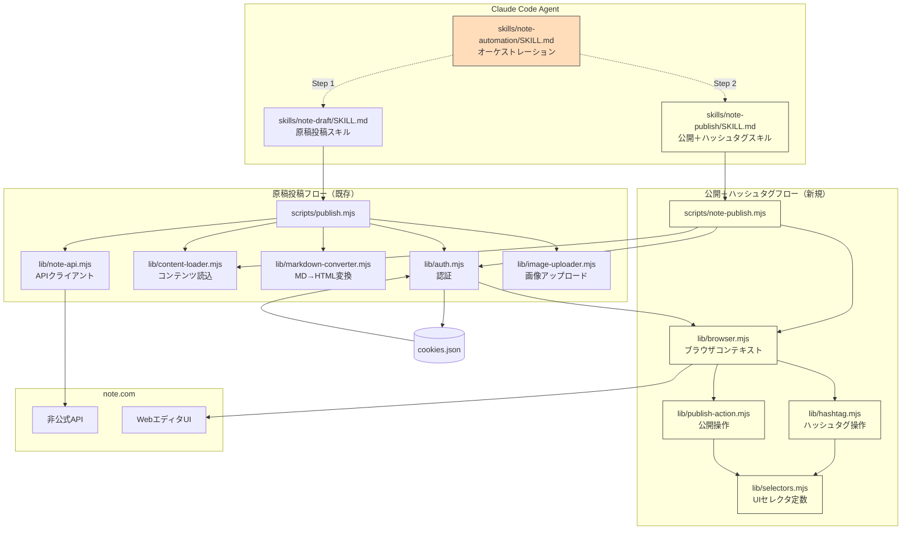
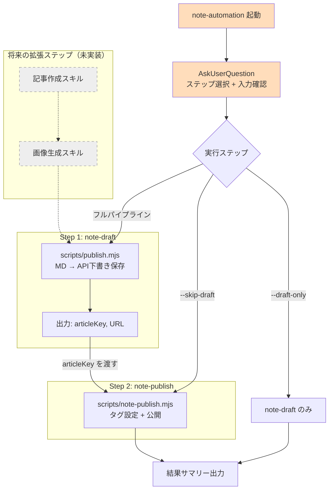
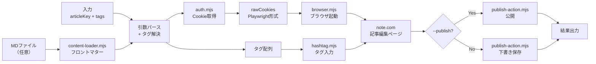

# 技術設計書 - note-publish + note-automation（スキル拡張）

## 1. 要件トレーサビリティマトリックス

| 要件ID | 要件内容 | 設計項目 | 既存資産 | 新規理由 |
|--------|---------|---------|---------|---------|
| REQ-P001 | skills/ディレクトリ3スキル構成 | §3.1 ファイル構造 | SKILL.md（移行） | skills/パターン導入 |
| REQ-P002 | Playwrightブラウザコンテキスト構築 | §5 BrowserModule | auth.mjs（Cookie再利用） | ブラウザ操作は新規 |
| REQ-P003 | 記事編集ページへのナビゲーション | §5 BrowserModule | ❌新規 | note.com固有のUI操作 |
| REQ-P004 | ハッシュタグの入力 | §5 HashtagModule | ❌新規 | Playwrightによるタグ入力 |
| REQ-P005 | 記事の公開 | §5 PublishModule | ❌新規 | Playwrightによる公開操作 |
| REQ-P006 | CLIインターフェース | §5 note-publish.mjs | ❌新規 | 新スクリプト |
| REQ-P007 | skills/note-publish/SKILL.md | §3.1 スキル定義 | ❌新規 | 新スキル定義 |
| REQ-P008 | SKILL.md移行+更新 | §3.1 スキル定義 | SKILL.md（移行） | skills/パターン移行 |
| REQ-P009 | note-automationオーケストレーション | §3.3 note-automation設計 | ❌新規 | パイプライン制御 |
| REQ-P010 | パイプラインステップ制御 | §3.3 note-automation設計 | ❌新規 | 選択式ステップ実行 |
| NFR-P001 | 既存モジュール再利用 | §3 アーキテクチャ | auth.mjs, content-loader.mjs | - |
| NFR-P002 | ブラウザ自動化の信頼性 | §5 セレクタ管理, §8 エラーハンドリング | ❌新規 | UI依存のリスク対策 |
| NFR-P003 | テスト戦略 | §9 テスト戦略 | tests/unit/（拡張） | ヘルスチェック新規 |
| CON-P001 | ブラウザ自動化への依存 | §12 技術的決定事項 | - | リスク認識 |
| CON-P002 | note.comエディタのUI依存 | §2 エディタUI仕様 | - | UI調査で対応 |
| CON-P003 | 既存リポジトリ内での拡張 | §3.1 skills/ディレクトリパターン | SKILL.md（移行） | skills/パターン導入 |
| ASM-P001 | 既存環境 | §3.1 前提（npm, Playwright） | - | 環境前提 |
| ASM-P002 | 記事の状態 | §5 BrowserModule（ナビゲーション） | - | 入力バリデーション |
| ASM-P003 | UI調査の完了 | §2 エディタUI仕様（調査方法） | - | TP01で対応 |

## 2. note.com エディタUI仕様（要事前調査）

### 2.1 調査が必要な項目

実装前に Playwright のデバッグモード（`headless: false`）でnote.comのエディタUIを調査し、以下のセレクタを確定する必要がある。

| 項目 | 想定される操作 | 調査対象 |
|------|-------------|---------|
| 記事編集ページURL | ナビゲーション | `https://note.com/notes/{articleKey}/edit` の形式 |
| ハッシュタグ入力欄 | タグ入力 | 入力フィールドのセレクタ、確定方法（Enter/Space/ボタン） |
| 公開設定ボタン | 公開フロー | 「公開」ボタン or 「公開設定」リンクのセレクタ |
| 公開確認ダイアログ | 公開確定 | 確認モーダルの有無、確定ボタンのセレクタ |
| 下書き保存ボタン | 下書き保存 | 「下書き保存」ボタンのセレクタ |

### 2.2 調査方法

```javascript
// scripts/inspect-editor.mjs — UI調査用スクリプト（開発時のみ使用）
// headless: false でブラウザを開き、記事編集画面の要素を確認する
const browser = await chromium.launch({ headless: false });
const context = await browser.newContext();
await context.addCookies(rawCookies);
const page = await context.newPage();
await page.goto('https://note.com/notes/{articleKey}/edit');
await page.pause(); // Playwright Inspector が開く
```

### 2.3 セレクタ定数（調査後に確定）

```javascript
// lib/selectors.mjs — note.comのUIセレクタを一元管理
export const SELECTORS = {
  // 記事編集画面
  EDITOR_PAGE_LOADED: '調査後に確定',    // 編集画面のロード完了を示す要素

  // ハッシュタグ
  HASHTAG_INPUT: '調査後に確定',          // ハッシュタグ入力フィールド
  HASHTAG_CONFIRM: '調査後に確定',        // タグ確定アクション（Enter? ボタン?）

  // 公開操作
  PUBLISH_SETTINGS_BUTTON: '調査後に確定', // 「公開設定」ボタン
  PUBLISH_BUTTON: '調査後に確定',          // 「公開」ボタン
  DRAFT_SAVE_BUTTON: '調査後に確定',       // 「下書き保存」ボタン
  PUBLISH_CONFIRM: '調査後に確定',         // 公開確認ダイアログの確定ボタン
};
```

## 3. アーキテクチャ概要

### 3.1 skills/ ディレクトリパターン（3スキル構成）

`agent-skills` リポジトリと同じ `skills/{name}/SKILL.md` パターンを採用する。
既存のルート `SKILL.md` は `skills/note-draft/SKILL.md` に移行し、ルートからは削除する。

各 SKILL.md では `$SKILL_DIR/../../` でリポジトリルートを参照し、共有の `lib/` と `scripts/` にアクセスする。

```
note-md-publisher/
├── skills/                       # スキル定義ディレクトリ（新規）
│   ├── note-draft/               # 原稿投稿スキル（既存SKILL.mdから移行）
│   │   └── SKILL.md
│   ├── note-publish/             # 公開＋ハッシュタグスキル（新規）
│   │   └── SKILL.md
│   └── note-automation/          # オーケストレーションスキル（新規）
│       └── SKILL.md
├── scripts/
│   ├── publish.mjs               # 原稿投稿スクリプト（既存）
│   ├── note-publish.mjs          # 公開＋ハッシュタグスクリプト（新規）
│   └── inspect-editor.mjs        # UI調査用スクリプト（開発用）
├── lib/
│   ├── auth.mjs                  # 認証（既存、全スキル共有）
│   ├── content-loader.mjs        # コンテンツ読込（既存、全スキル共有）
│   ├── markdown-converter.mjs    # MD→HTML変換（既存、note-draft用）
│   ├── note-api.mjs              # APIクライアント（既存、note-draft用）
│   ├── image-uploader.mjs        # 画像アップロード（既存、note-draft用）
│   ├── browser.mjs               # ブラウザコンテキスト管理（新規、note-publish用）
│   ├── hashtag.mjs               # ハッシュタグ操作（新規、note-publish用）
│   ├── publish-action.mjs        # 公開操作（新規、note-publish用）
│   └── selectors.mjs             # UIセレクタ定数（新規、note-publish用）
├── tests/
│   ├── unit/                     # ユニットテスト（拡張）
│   └── fixtures/                 # テストデータ（拡張）
├── package.json                  # 依存関係（全スキル共有）
├── .env.example
└── README.md
```

### 3.1.1 SKILL.md 内のパス参照

```bash
# skills/note-draft/SKILL.md 内
REPO_ROOT="$SKILL_DIR/../.."
cd "$REPO_ROOT" && node scripts/publish.mjs <path>

# skills/note-publish/SKILL.md 内
REPO_ROOT="$SKILL_DIR/../.."
cd "$REPO_ROOT" && node scripts/note-publish.mjs <article> [options]

# skills/note-automation/SKILL.md 内（スクリプトは持たず、上記を順次呼び出す）
REPO_ROOT="$SKILL_DIR/../.."
cd "$REPO_ROOT" && node scripts/publish.mjs <path>        # Step 1
cd "$REPO_ROOT" && node scripts/note-publish.mjs <key> ... # Step 2
```

### 3.2 システム構成図



### 3.3 メインフロー（シーケンス図）

```mermaid
sequenceDiagram
    participant Agent as Claude Code Agent
    participant Script as note-publish.mjs
    participant Auth as auth.mjs
    participant Browser as browser.mjs
    participant Hashtag as hashtag.mjs
    participant Publish as publish-action.mjs
    participant Note as note.com WebUI

    Agent->>Script: node scripts/note-publish.mjs <article> [options]

    Script->>Auth: authenticate()
    Auth-->>Script: cookies + rawCookies

    Script->>Browser: createBrowserContext(rawCookies)
    Browser->>Browser: chromium.launch({ headless: true })
    Browser->>Browser: context.addCookies(rawCookies)
    Browser->>Note: page.goto(editPageUrl)
    Note-->>Browser: 編集画面ロード完了

    opt ハッシュタグ指定あり
        Script->>Hashtag: setHashtags(page, tags)
        loop 各タグ
            Hashtag->>Note: タグ入力欄にフォーカス
            Hashtag->>Note: タグ文字列を入力
            Hashtag->>Note: 確定操作（Enter等）
            Note-->>Hashtag: タグ追加完了
        end
    end

    alt --publish 指定
        Script->>Publish: publishArticle(page)
        Publish->>Note: 公開ボタンクリック
        Note-->>Publish: 公開確認ダイアログ
        Publish->>Note: 確定ボタンクリック
        Note-->>Publish: 公開完了
    else 下書き保存（デフォルト）
        Script->>Browser: 下書き保存ボタンクリック（タグ反映のため）
    end

    Browser->>Browser: browser.close()
    Script-->>Agent: 結果出力（URL + ステータス）
```

## 4. note-automation パイプライン設計

### 4.1 パイプライン構成

note-automation は SKILL.md のみで構成され、専用スクリプトを持たない。
Claude Code エージェントが SKILL.md の指示に従い、各ステップのスクリプトを順次実行する。



### 4.2 ステップ制御オプション

| オプション | 実行されるステップ | ユースケース |
|-----------|------------------|-------------|
| （未指定） | note-draft → note-publish（タグ＋公開） | MDファイルから公開まで一気通貫 |
| `--skip-draft` | note-publish のみ（タグ＋公開） | 既存の下書き記事にタグ＋公開 |
| `--skip-publish` | note-draft → note-publish（タグ設定のみ、公開なし） | 下書き投稿＋タグ設定まで（公開はスキップ） |
| `--draft-only` | note-draft のみ | 下書き投稿のみ実行（タグ設定・公開なし） |

**補足**: `--skip-publish` は公開操作のみスキップし、タグ設定は実行する（note-publish を `--publish` なしで呼び出す）。`--draft-only` は note-publish スキル自体をスキップし、note-draft のみ実行する。

### 4.3 ステップ間データ受け渡し

```
Step 1 (note-draft) の出力:
  ✓ 記事を下書き保存しました
    URL: https://note.com/username/n/n1a2b3c4d5e6
    記事ID: 12345678

  → 出力をパースし、articleKey "n1a2b3c4d5e6" を抽出

Step 2 (note-publish) の入力:
  node scripts/note-publish.mjs n1a2b3c4d5e6 --tags "AI,..." --publish
```

note-automation の SKILL.md で、Step 1 の stdout から articleKey を正規表現で抽出し、Step 2 に渡す手順を定義する。

### 4.4 AskUserQuestion フロー

```
note-automation 起動時:

Q1: "入力ファイルを指定してください"
    → MDファイルパス or 既存下書きURL

Q2: "実行するステップを選択してください"
    options:
    - "フル実行: 下書き投稿 → タグ設定 → 公開（推奨）"
    - "下書き投稿のみ"
    - "タグ設定 + 公開のみ（既存下書きに対して）"

Q3: "ハッシュタグを指定してください"
    options:
    - "フロントマターから自動取得（推奨）"
    - "手動で入力する"
    - "タグなし"

Q4: "公開しますか？"
    options:
    - "公開する"
    - "下書きのまま（タグ設定のみ）"
```

### 4.5 将来の拡張設計

note-automation の SKILL.md にステップを追加するだけで拡張できる。

```
# 将来のフルパイプライン
Step 0: 記事作成スキル    → MD ファイル生成
Step 1: 画像生成スキル    → アイキャッチ画像生成
Step 2: note-draft       → API 下書き保存（MD + 画像）
Step 3: note-publish     → タグ設定 + 公開
```

各ステップは `--skip-{step}` で個別にスキップ可能。SKILL.md のパイプライン定義に新ステップを追記するだけで対応できる。

### 4.6 note-publish 単独利用時の入力

note-publish は note-automation を経由せず単独でも利用可能。

```
# チェーン実行（投稿スキルの出力を入力）
node scripts/note-publish.mjs n7ec97196b4f4 --tags "AI,プログラミング" --publish

# URL指定（手動で作った下書きに対して）
node scripts/note-publish.mjs https://note.com/username/n/n7ec97196b4f4 --tags "AI"

# MDファイル指定（フロントマターからタグを読み取り）
node scripts/note-publish.mjs n7ec97196b4f4 --md path/to/article.md

# タグ設定のみ（公開しない）
node scripts/note-publish.mjs n7ec97196b4f4 --tags "AI,プログラミング"
```

## 5. モジュール設計

### [REQ-P002] BrowserModule（lib/browser.mjs）

> 📌 要件: Playwrightでログイン状態のブラウザコンテキストを構築し、記事編集ページに遷移する

```
export async function openArticleEditor(articleInput, rawCookies): Promise<BrowserSession>
  - articleInput を解析して articleKey を抽出
    - URL形式 → パスから抽出（/n/{key} 部分）
    - キー形式（n で始まる英数字）→ そのまま使用
    - 数値 → 記事IDとして扱う（別途URLパターンが必要）
  - chromium.launch({ headless: true })
  - context.addCookies(rawCookies)
  - page.goto(editPageUrl)
  - SELECTORS.EDITOR_PAGE_LOADED を待機（timeout: 30s）
  - BrowserSession を返す

export async function closeBrowser(session: BrowserSession): Promise<void>
  - browser.close()

type BrowserSession = {
  browser: Browser
  context: BrowserContext
  page: Page
  articleKey: string
}

internal function parseArticleInput(input: string): { articleKey: string }
  - URL: /n/([a-z0-9]+) からキーを抽出
  - Key: /^n[a-z0-9]+$/ にマッチ → そのまま
  - ID: /^\d+$/ にマッチ → 記事ID（editPageのURL形式を要調査）
  - いずれにもマッチしない → エラー

internal function buildEditUrl(articleKey: string): string
  - 編集ページURL形式を返す（要UI調査で確定）
```

### [REQ-P004] HashtagModule（lib/hashtag.mjs）

> 📌 要件: Playwrightでハッシュタグ入力欄にタグを設定する

```
export async function setHashtags(page: Page, tags: string[]): Promise<void>
  - SELECTORS.HASHTAG_INPUT の存在を確認
  - 各タグについて:
    1. 入力欄をクリック（フォーカス）
    2. タグ文字列を入力（page.type で1文字ずつ or page.fill）
    3. 確定操作（Enter キー or SELECTORS.HASHTAG_CONFIRM クリック）
    4. 入力完了の待機（タグバッジの出現を確認）
  - 全タグの入力完了を確認

export function parseTags(input: string): string[]
  - カンマ区切り文字列を配列に変換
  - 各タグの前後空白をトリム
  - 空文字列を除外
  - "#" プレフィックスがあれば除去
```

### [REQ-P005] PublishModule（lib/publish-action.mjs）

> 📌 要件: Playwrightで記事を公開する

```
export async function publishArticle(page: Page): Promise<void>
  - SELECTORS.PUBLISH_SETTINGS_BUTTON をクリック（公開設定画面へ）
  - 公開設定画面のロード完了を待機
  - SELECTORS.PUBLISH_BUTTON をクリック
  - 確認ダイアログがあれば SELECTORS.PUBLISH_CONFIRM をクリック
  - 公開完了を待機（URL変更 or 成功メッセージの出現）

export async function saveDraft(page: Page): Promise<void>
  - SELECTORS.DRAFT_SAVE_BUTTON をクリック
  - 保存完了を待機
```

### UIセレクタ管理（lib/selectors.mjs）

> 📌 要件: note.com UIのセレクタを一元管理し、UI変更時の保守を容易にする

```
export const SELECTORS = {
  EDITOR_PAGE_LOADED: '...',     // 要調査
  HASHTAG_INPUT: '...',          // 要調査
  HASHTAG_CONFIRM: '...',        // 要調査
  PUBLISH_SETTINGS_BUTTON: '...', // 要調査
  PUBLISH_BUTTON: '...',         // 要調査
  DRAFT_SAVE_BUTTON: '...',      // 要調査
  PUBLISH_CONFIRM: '...',        // 要調査
};
```

### [REQ-P006] メインスクリプト（scripts/note-publish.mjs）

> 📌 要件: CLI引数をパースし、ブラウザ操作を実行する

```
CLI引数パース:
  node scripts/note-publish.mjs <article> [options]

  <article>     : 記事URL、記事キー、または記事ID（必須）
  --tags <csv>  : カンマ区切りのハッシュタグ（任意）
  --md <path>   : MDファイルパス（フロントマターからタグ読取）（任意）
  --publish     : 公開する（任意。未指定時は下書き保存のまま）
  --yes         : 確認プロンプトをスキップ（任意）
  --help        : ヘルプ表示

メインフロー:
  1. 引数パース
  2. タグの解決（--tags or --md のフロントマター）
  3. authenticate() → cookies + rawCookies の取得
  4. openArticleEditor(article, rawCookies) → BrowserSession
  5. タグあり → setHashtags(page, tags)
  6. --publish → publishArticle(page) / なし → saveDraft(page)
  7. closeBrowser(session)
  8. 結果出力

出力例:
  ✓ ハッシュタグを設定し、記事を公開しました
    URL: https://note.com/username/n/n1a2b3c4d5e6
    タグ: #AI, #プログラミング
    ステータス: published

  ✓ ハッシュタグを設定しました（下書き）
    URL: https://note.com/username/n/n1a2b3c4d5e6
    タグ: #AI, #プログラミング
    ステータス: draft

エラー出力例:
  ✗ ハッシュタグの設定に失敗しました
    エラー: ハッシュタグ入力欄が見つかりません。note.comのUI変更の可能性があります
    対処: note.comのWebUIから手動で設定してください
```

## 6. rawCookies の再利用設計

### 6.1 既存のCookie保存構造

```json
// ~/.config/note-md-publisher/cookies.json
{
  "cookies": {            // ← API用（note-api.mjs で使用）
    "_note_session_v5": "abc123..."
  },
  "rawCookies": [         // ← Playwright用（本スキルで使用）
    {
      "name": "_note_session_v5",
      "value": "abc123...",
      "domain": ".note.com",
      "path": "/",
      "expires": 1700000000,
      "httpOnly": true,
      "secure": true
    }
  ],
  "savedAt": "2026-02-25T00:00:00.000Z"
}
```

### 6.2 auth.mjs の拡張

```
// 既存: cookies dict のみ返す
export async function authenticate(): Promise<CookieDict>

// 追加: rawCookies も返すオーバーロード
export async function authenticateWithRaw(): Promise<{ cookies: CookieDict, rawCookies: PlaywrightCookie[] }>
  - loadCookies() でファイルから読み込み
  - rawCookies が存在すればそれも返す
  - rawCookies が存在しない場合は再ログインして取得
```

## 7. データフロー



## 8. エラーハンドリング

| エラー種別 | 原因 | 対処 | メッセージ |
|-----------|------|------|-----------|
| 認証エラー | Cookie期限切れ | 自動再ログイン | 「再ログイン中...」 |
| ページ遷移エラー | 記事が存在しない or アクセス権なし | 記事キーの確認を促す | 「記事が見つかりません: {key}」 |
| セレクタ未検出 | note.comのUI変更 | 手動操作を案内 | 「{要素名}が見つかりません。note.comのUI変更の可能性があります」 |
| タイムアウト | ページ描画の遅延 | リトライ案内 | 「操作がタイムアウトしました。再実行してください」 |
| タグ入力エラー | タグ確定の失敗 | 入力結果の検証 | 「タグ '{tag}' の設定に失敗しました」 |
| 公開エラー | 公開操作の失敗 | WebUIでの手動操作を案内 | 「公開に失敗しました。WebUIから手動で公開してください」 |

## 9. テスト戦略

### 9.1 ユニットテスト（自動、常時実行可能）

| テスト対象 | テストファイル | テスト内容 |
|-----------|-------------|-----------|
| タグパース | `tests/unit/hashtag.test.mjs` | `parseTags()` のカンマ区切り、空白トリム、# 除去 |
| 記事入力パース | `tests/unit/browser.test.mjs` | `parseArticleInput()` のURL、キー、ID解析 |
| CLI引数パース | `tests/unit/note-publish-cli.test.mjs` | 引数の組み合わせバリデーション |

### 9.2 セレクタヘルスチェック（手動、認証必要）

```bash
# note.comのUIセレクタが有効か検証
node scripts/inspect-editor.mjs --check
```

- 各 SELECTORS の要素が記事編集ページに存在するかを検証
- セレクタが無効な場合、どの要素が見つからないかを報告
- note.comのUI更新後に実行して、修正箇所を特定する

### 9.3 E2Eテスト（手動）

チェックリスト:
- [ ] 記事キー指定でハッシュタグが設定される
- [ ] URL指定でハッシュタグが設定される
- [ ] `--md` 指定でフロントマターからタグが読み取られる
- [ ] `--publish` で記事が公開される
- [ ] タグ設定のみ（公開なし）で下書き状態が維持される
- [ ] 既存タグがある記事に追加タグが設定される
- [ ] 存在しない記事キーで適切なエラーが表示される

## 10. 技術スタック

| カテゴリ | 技術 | バージョン要件 | 備考 |
|---------|------|-------------|------|
| ランタイム | Node.js | 18+ | ESM (.mjs), 標準 fetch API |
| ブラウザ自動化 | Playwright | 既存バージョン（package.json準拠） | Chromium のみ使用 |
| テスト | node:test | Node.js 18+ 標準搭載 | 追加依存なし |
| MD解析 | gray-matter | 既存（content-loader.mjs で使用） | フロントマター解析 |

**追加依存なし**: 本拡張で新たな npm パッケージの追加は不要。Playwright は既に認証機能で導入済み。

## 11. セキュリティ設計

| 項目 | 対策 |
|------|------|
| Cookie管理 | `cookies.json` はパーミッション 0600 で保存（既存）。rawCookies も同ファイルに含まれるため追加対策不要 |
| 認証情報 | `.env` のメールアドレス・パスワードはブラウザ自動化でも Playwright 経由のみ使用。スクリプト内にハードコードしない |
| headless モード | デフォルト `headless: true` で動作。デバッグ時のみ `headless: false`（開発者のローカル環境限定） |
| ブラウザコンテキスト | 操作完了後に必ず `browser.close()` を呼び出し、セッションを残さない |
| エラー時のスクリーンショット | スクリーンショットにはログイン状態のページが含まれる可能性があるため、デバッグ用途のみとし `.gitignore` に追加する |

## 12. 技術的決定事項

| 決定項目 | 選択 | 理由 |
|---------|------|------|
| ブラウザ自動化 | Playwright（既存） | 認証で導入済み。追加依存なし |
| セレクタ管理 | 定数ファイル一元管理 | UI変更時の影響範囲を最小化 |
| 入力形式 | URL/キー/IDの3形式対応 | チェーン実行（キー渡し）と手動利用（URL指定）の両方に対応 |
| auth.mjs 拡張 | `authenticateWithRaw()` 追加 | 既存の `authenticate()` を破壊しない |
| headless モード | デフォルト headless: true | CI/サーバー環境での動作を保証 |
| タグ入力方式 | 1文字ずつ入力（page.type） | page.fill だとIME変換イベントが発生しない場合があるため |
