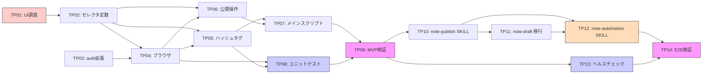

# タスクリスト - note-publish（Playwright公開＋ハッシュタグスキル）

## 1. 概要

Agile戦略で段階的に構築する。
Phase 1 でnote.comのUI調査とセレクタ確定を行い、Phase 2 でブラウザ操作モジュールを実装、Phase 3 でスキル化と統合を行う。

### MVP定義（Phase 2 完了時点）

CLIから記事キーとタグを指定して、note.comの下書き記事にハッシュタグを設定できる状態。

## 2. タスク一覧

### Phase 1: UI調査 + 基盤

- [x] TP01: note.com エディタUI調査（セレクタ確定）
- [x] TP02: セレクタ定数モジュール作成
- [x] TP03: auth.mjs 拡張（rawCookies 返却対応）

### Phase 2: ブラウザ操作モジュール実装（MVP）

- [x] TP04: [REQ-P002, REQ-P003] ブラウザコンテキスト + ナビゲーション
- [x] TP05: [REQ-P004] ハッシュタグ入力モジュール
- [x] TP06: [REQ-P005] 公開操作モジュール
- [x] TP07: [REQ-P006] メインスクリプト（note-publish.mjs）
- [x] TP08: [NFR-P003] ユニットテスト
- [ ] TP09: MVP動作検証（ハッシュタグ設定の実機確認）

### Phase 3: スキル化 + 統合

- [x] TP10: [REQ-P007] skills/note-publish/SKILL.md 作成
- [x] TP11: [REQ-P008, REQ-P001] SKILL.md の skills/ への移行
- [x] TP12: [REQ-P009, REQ-P010] skills/note-automation/SKILL.md 作成
- [x] TP13: セレクタヘルスチェックスクリプト
- [ ] TP14: E2E動作検証 + ドキュメント更新

### 優先度マッピング

| 優先度 | Phase | タスク | 根拠 |
|--------|-------|--------|------|
| P0（必須） | Phase 1 | TP01 | セレクタが確定しないと実装できない |
| P0（必須） | Phase 1 | TP02, TP03 | 後続タスクの前提条件 |
| P0（必須） | Phase 2 | TP04, TP05, TP07 | MVP実現に不可欠 |
| P1（重要） | Phase 2 | TP06, TP08, TP09 | 公開機能とテスト |
| P2（推奨） | Phase 3 | TP10, TP11, TP12, TP13, TP14 | スキル化・配布 |

## 3. タスク詳細

### Phase 1: UI調査 + 基盤

---

### TP01: note.com エディタUI調査（セレクタ確定）

- 要件ID: CON-P002, ASM-P003
- 設計書参照: design.md §2
- 依存関係: なし
- 対象ファイル: `scripts/inspect-editor.mjs`（新規、開発用）
- 完了条件:
  - [ ] Playwright デバッグモード（headless: false）で記事編集ページを開ける
  - [ ] 記事編集ページのURL形式が確定している
  - [ ] ハッシュタグ入力欄のセレクタが特定されている
  - [ ] ハッシュタグの確定方法（Enter/Space/ボタン）が判明している
  - [ ] 公開設定ボタンのセレクタが特定されている
  - [ ] 公開確認フローのセレクタが特定されている
  - [ ] 下書き保存ボタンのセレクタが特定されている
  - [ ] 調査結果が design.md §2.3 のセレクタ定数に反映されている
- 備考: このタスクが最も重要。セレクタが確定しないと後続の実装ができない。DevToolsとPlaywright Inspector の両方で確認する

---

### TP02: セレクタ定数モジュール作成

- 要件ID: NFR-P002
- 設計書参照: design.md §2.3
- 依存関係: TP01
- 対象ファイル: `lib/selectors.mjs`（新規）
- 完了条件:
  - [ ] TP01 で確定した全セレクタが定数として定義されている
  - [ ] セレクタの説明コメントが各定数に付与されている
  - [ ] ESM export で他モジュールから参照可能

---

### TP03: auth.mjs 拡張（rawCookies 返却対応）

- 要件ID: REQ-P002, NFR-P001
- 設計書参照: design.md §6.2
- 依存関係: なし
- 対象ファイル: `lib/auth.mjs`（修正）
- 完了条件:
  - [ ] `authenticateWithRaw()` 関数が追加されている
  - [ ] `{ cookies, rawCookies }` の両方を返す
  - [ ] `cookies.json` から rawCookies を読み込める
  - [ ] rawCookies が存在しない場合は再ログインして取得する
  - [ ] 既存の `authenticate()` が破壊されていない
  - [ ] 既存のユニットテスト（あれば）がパスする
- 並列実行: TP01 と同時実行可能

---

### Phase 2: ブラウザ操作モジュール実装（MVP）

---

### TP04: [REQ-P002, REQ-P003] ブラウザコンテキスト + ナビゲーション

- 要件ID: REQ-P002, REQ-P003
- 設計書参照: design.md §5 BrowserModule
- 依存関係: TP02, TP03
- 対象ファイル: `lib/browser.mjs`（新規）
- 完了条件:
  - [ ] `openArticleEditor(articleInput, rawCookies)` が実装されている
  - [ ] `closeBrowser(session)` が実装されている
  - [ ] URL形式の入力から articleKey を抽出できる
  - [ ] キー形式の入力をそのまま使用できる
  - [ ] 不正な入力でエラーを返す
  - [ ] rawCookies で Playwright コンテキストを構築できる
  - [ ] 記事編集ページに遷移し、ページロード完了を待機できる
  - [ ] 記事が存在しない場合に明確なエラーを返す

---

### TP05: [REQ-P004] ハッシュタグ入力モジュール

- 要件ID: REQ-P004
- 設計書参照: design.md §5 HashtagModule
- 依存関係: TP02, TP04
- 対象ファイル: `lib/hashtag.mjs`（新規）
- 完了条件:
  - [ ] `setHashtags(page, tags)` が実装されている
  - [ ] `parseTags(input)` が実装されている
  - [ ] カンマ区切り文字列をタグ配列に変換できる
  - [ ] "#" プレフィックスの有無を処理できる
  - [ ] ハッシュタグ入力欄を見つけてフォーカスできる
  - [ ] タグを入力し確定操作を実行できる
  - [ ] 複数タグを順番に入力できる
  - [ ] セレクタが見つからない場合に明確なエラーを返す

---

### TP06: [REQ-P005] 公開操作モジュール

- 要件ID: REQ-P005
- 設計書参照: design.md §5 PublishModule
- 依存関係: TP02, TP04
- 対象ファイル: `lib/publish-action.mjs`（新規）
- 完了条件:
  - [ ] `publishArticle(page)` が実装されている
  - [ ] `saveDraft(page)` が実装されている
  - [ ] 公開ボタンのクリックと確認フローが動作する
  - [ ] 下書き保存ボタンのクリックが動作する
  - [ ] セレクタが見つからない場合に明確なエラーを返す
- 並列実行: TP05 と同時実行可能

---

### TP07: [REQ-P006] メインスクリプト（note-publish.mjs）

- 要件ID: REQ-P006
- 設計書参照: design.md §5 メインスクリプト
- 依存関係: TP04, TP05, TP06
- 対象ファイル: `scripts/note-publish.mjs`（新規）
- 完了条件:
  - [ ] CLI引数パース（article, --tags, --md, --publish, --yes, --help）が動作する
  - [ ] `--tags` からタグを取得できる
  - [ ] `--md` 指定時にフロントマターからタグを読み取れる
  - [ ] `--tags` と `--md` の両方指定時は `--tags` が優先される
  - [ ] 認証 → ブラウザ起動 → タグ設定 → 公開/下書き保存 のフローが動作する
  - [ ] 成功時にURL、タグ、ステータスを表示する
  - [ ] エラー時に原因と対処法を表示する

---

### TP08: [NFR-P003] ユニットテスト

- 要件ID: NFR-P003
- 設計書参照: design.md §9.1
- 依存関係: TP04, TP05
- 対象ファイル:
  - `tests/unit/hashtag.test.mjs`（新規）
  - `tests/unit/browser.test.mjs`（新規）
- 完了条件:
  - [ ] `parseTags()` テスト:
    - [ ] カンマ区切り → 配列変換
    - [ ] 前後空白トリム
    - [ ] "#" プレフィックス除去
    - [ ] 空文字列除外
    - [ ] 空入力でエラーにならない
  - [ ] `parseArticleInput()` テスト:
    - [ ] URL形式からキー抽出
    - [ ] キー形式（n で始まる英数字）の受理
    - [ ] 不正入力でのエラー
  - [ ] `node --test tests/unit/` で全テストがパスする
- 並列実行: TP07 と同時実行可能

---

### TP09: MVP動作検証

- 要件ID: -（品質ゲート）
- 依存関係: TP07, TP08
- 完了条件:
  - [ ] 記事キー指定でハッシュタグが設定される
  - [ ] note.com上で記事にタグが表示される
  - [ ] 複数タグが正しく設定される
  - [ ] `--publish` で記事が公開される
  - [ ] タグ設定のみ（--publish なし）で下書き状態が維持される
  - [ ] 存在しない記事キーで適切なエラーメッセージが表示される
  - [ ] ユニットテストが全パスする

---

### Phase 3: スキル化 + 統合

---

### TP10: [REQ-P007] skills/note-publish/SKILL.md 作成

- 要件ID: REQ-P007
- 設計書参照: design.md §3.1
- 依存関係: TP09（MVP完了後）
- 対象ファイル: `skills/note-publish/SKILL.md`（新規）
- 完了条件:
  - [ ] YAML フロントマター（name: note-publish, description, license）が正しい
  - [ ] フロントマターの `name` がディレクトリ名と一致している
  - [ ] トリガーフレーズ（日英）が定義されている
    - 日: 「noteの記事を公開して」「ハッシュタグを設定して」
    - 英: "Publish note article", "Set hashtags on note"
  - [ ] AskUserQuestion で以下を確認するフローが定義されている:
    - 対象記事（URL or キー）
    - ハッシュタグ（入力 or MDファイル指定）
    - 公開するかどうか
  - [ ] `$SKILL_DIR/../../scripts/note-publish.mjs` のパスでスクリプト実行手順が含まれる
  - [ ] 原稿投稿スキル（note-draft）とのチェーン実行の案内が含まれる
  - [ ] 成功・失敗時のフィードバックが定義されている

---

### TP11: [REQ-P008, REQ-P001] SKILL.md の skills/ への移行

- 要件ID: REQ-P008, REQ-P001
- 設計書参照: design.md §3.1
- 依存関係: TP10
- 対象ファイル:
  - `skills/note-draft/SKILL.md`（新規: 既存 `SKILL.md` から移行）
  - `SKILL.md`（削除: ルートから削除）
- 完了条件:
  - [ ] `skills/note-draft/` ディレクトリが作成されている
  - [ ] 既存 `SKILL.md` の内容が `skills/note-draft/SKILL.md` に移行されている
  - [ ] フロントマターの `name` が `note-draft` に更新されている
  - [ ] スクリプト実行パスが `$SKILL_DIR/../../scripts/publish.mjs` に修正されている
  - [ ] 投稿完了メッセージに公開スキル（note-publish）の案内が追加されている
  - [ ] フロントマターの `tags` フィールドの説明に、公開スキルとの連携を記載
  - [ ] ルートの `SKILL.md` が削除されている
- 並列実行: TP10 と同時実行可能

---

### TP12: [REQ-P009, REQ-P010] skills/note-automation/SKILL.md 作成

- 要件ID: REQ-P009, REQ-P010
- 設計書参照: design.md §4（note-automationパイプライン設計）
- 依存関係: TP10, TP11（note-draft, note-publish の SKILL.md が完成後）
- 対象ファイル: `skills/note-automation/SKILL.md`（新規）
- 完了条件:
  - [ ] YAML フロントマター（name: note-automation, description, license）が正しい
  - [ ] フロントマターの `name` がディレクトリ名と一致している
  - [ ] トリガーフレーズ（日英）が定義されている
    - 日: 「noteに記事を投稿して公開して」「note自動投稿」
    - 英: "Automate note publishing", "Post and publish to note"
  - [ ] AskUserQuestion でパイプライン構成を確認するフローが定義されている:
    - 入力ファイル / 既存下書きURL
    - 実行ステップの選択（フル / 下書きのみ / タグ+公開のみ）
    - ハッシュタグ指定方法（フロントマター自動 / 手動入力 / なし）
    - 公開の有無
  - [ ] Step 1（note-draft）の stdout から articleKey を抽出する手順が定義されている
  - [ ] Step 2（note-publish）に articleKey を渡す手順が定義されている
  - [ ] `--skip-draft`, `--skip-publish`, `--draft-only` のステップ制御が定義されている
  - [ ] 各ステップの成功/失敗時のフィードバックとエラーハンドリングが定義されている
  - [ ] 将来の拡張ステップ（記事作成、画像生成）の追加方法がコメントで示されている
- 並列実行: TP13 と同時実行可能

---

### TP13: セレクタヘルスチェックスクリプト

- 要件ID: NFR-P002, NFR-P003
- 設計書参照: design.md §9.2
- 依存関係: TP09（MVP完了後）
- 対象ファイル: `scripts/inspect-editor.mjs`（修正: --check モード追加）
- 完了条件:
  - [ ] `--check` フラグで全セレクタの存在チェックを実行できる
  - [ ] 各セレクタの検証結果（OK/NG）を一覧表示する
  - [ ] NGのセレクタがある場合、修正が必要な箇所を案内する
  - [ ] 正常系（全セレクタOK）で exit code 0、異常系で exit code 1 を返す

---

### TP14: E2E動作検証 + ドキュメント更新

- 要件ID: -（品質ゲート）
- 依存関係: TP10, TP11, TP12, TP13
- 完了条件:
  - [ ] note-automation のフルパイプライン（note-draft → note-publish）が動作する
  - [ ] note-automation の `--skip-draft` で既存下書きへのタグ設定＋公開が動作する
  - [ ] note-automation の `--draft-only` で下書き投稿のみが動作する
  - [ ] note-draft, note-publish が単独でも動作する
  - [ ] 手動で作った下書き記事に対して note-publish が動作する
  - [ ] URL指定、キー指定の両方で動作する
  - [ ] `--md` 指定でフロントマターからタグが読み取られる
  - [ ] セレクタヘルスチェック（`--check`）が正常に動作する
  - [ ] README.md に3スキル構成の説明が追加されている
  - [ ] CLAUDE.md に `skills/` ディレクトリ構成の情報が反映されている
  - [ ] `npx skills add` でのインストールが正常に動作する

## 4. 依存関係図

**凡例**: 🔴赤 = ブロッカー（UI調査）、🟣紫 = 品質ゲート、🔵青 = テスト、🟠橙 = オーケストレーション

## 5. 並列実行計画

| フェーズ | 順次実行 | 並列実行可能 |
|---------|---------|-------------|
| Phase 1 | TP01 → TP02 | TP01 ∥ TP03 |
| Phase 2 | TP04 → TP05, TP06 → TP07 → TP09 | TP05 ∥ TP06, TP07 ∥ TP08 |
| Phase 3 | TP10 → TP11 → TP12 → TP14 | TP12 ∥ TP13, TP10 ∥ TP13 |

## 6. リスク

| リスク | 影響 | 対策 | 確率 |
|--------|------|------|------|
| note.com エディタのUI変更 | セレクタが無効化、全ブラウザ操作が失敗 | セレクタを定数一元管理 + ヘルスチェックスクリプトで早期検知 | 中 |
| ハッシュタグ入力欄の操作が複雑（ドロップダウン候補等） | TP05 の実装が想定より困難 | Playwright Inspector で操作を録画して解析 | 中 |
| headless モードでの動作差異 | headless: true で要素が見つからない | headless: false でデバッグ → headless: true で検証 | 低 |
| Cookie有効期限と Playwright コンテキストの不整合 | ブラウザでは認証切れだがAPI用Cookieは有効 | rawCookies の有効性を事前検証（ページ遷移後にログイン画面でないことを確認） | 低 |
