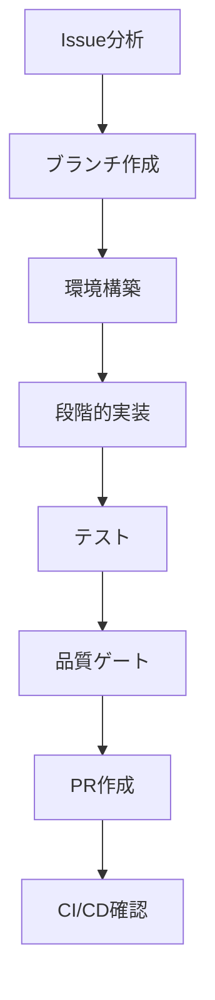

# Issue to PR ワークフローガイド

> spec-workflow-init により自動生成されました。
> 生成日時: 2026-02-25

## ワークフロー概要



## 開発環境

- **言語 / フレームワーク**: Node.js (ESM) / unified + Playwright
- **パッケージマネージャ**: npm
- **コンテナ**: なし
- **データベース**: なし
- **テストフレームワーク**: node:test
- **CI/CD**: なし
- **ブランチ戦略**: GitHub Flow
- **ブランチ命名**: `feature/{issue}-{slug}`
- **PRターゲット**: `main`
- **開発スタイル**: Implementation First

## 1. Issue分析とセットアップ

### Issue情報の取得

```bash
gh issue view {issue_number}
```

Issueを注意深く読み、以下を特定する:
- 受け入れ基準
- 技術的な制約
- 関連するIssueやPR

### 仕様書の確認

```bash
ls .specs/note-md-publisher/
cat .specs/note-md-publisher/requirement.md
cat .specs/note-md-publisher/design.md
cat .specs/note-md-publisher/tasks.md
```

### featureブランチの作成

```bash
git checkout main
git pull origin main
git checkout -b feature/{issue_number}-{slug}
```

## 2. 環境構築

```bash
npm install
```

## 3. 段階的実装

### Phase 1: 分析と設計

- 関連するソースコードを読み、既存のパターンを理解する
- 依存関係と影響範囲を特定する
- 実装方針を計画する

### Phase 2: コア実装

コーディングルールに従って機能を実装する。

```bash
# 動作確認
node scripts/publish.mjs <path/to/article.md>
```

### Phase 3: コードレビュー

実装コードをレビューする:
- coding-rules.md への準拠を確認
- セキュリティ脆弱性のチェック
- 適切なエラーハンドリングの確認

### Phase 4: テスト実装

実装した機能のテストを作成する。

```bash
# テスト実行
node --test tests/unit/
```

### Phase 5: テストレビュー

テストコードをレビューする:
- 十分なカバレッジの確認
- エッジケースのチェック
- テストの独立性の確認

### Phase 6: 品質ゲート

```bash
node --test tests/unit/
```

## 4. テスト

### API E2Eテスト

```bash
node --test tests/contract/
```

検証項目:
- 全APIエンドポイントが期待通りのレスポンスを返す
- エラーケースが適切に処理される
- 認証・認可が正しく動作する

## 5. PR作成と品質ゲート

### PR作成前チェックリスト

- [ ] 全テスト通過: `node --test tests/unit/`
- [ ] コントラクトテスト通過: `node --test tests/contract/`

### PR作成

```bash
gh pr create --base main --title "feat: {description} (closes #{issue_number})" --body "## 概要
- {summary_points}

## テスト計画
- [ ] ユニットテスト追加・更新
- [ ] API E2Eテスト検証済み

## 関連
- Closes #{issue_number}
- 仕様書: .specs/note-md-publisher/
"
```

## 6. CI/CD確認

### CIパイプラインの監視

```bash
gh run list --limit 5
gh run watch
```

### エラー復旧

CIが失敗した場合:

1. 失敗したステップを確認:
   ```bash
   gh run view {run_id} --log-failed
   ```
2. ローカルで問題を修正
3. 修正をプッシュ:
   ```bash
   git add -A && git commit -m "fix: CI失敗を修正" && git push
   ```
4. CIを再度監視

## エージェントロール（並列実行）

### 並列実行戦略

実装とテストコード生成を並列で実行する:

| フェーズ | 実装者 | テスター | レビュアー |
|---------|--------|---------|-----------|
| 分析 | 設計レビュー | テスト計画 | - |
| 実装 | コード作成 | テスト作成 | - |
| レビュー | - | - | コード＋テストレビュー |
| 品質ゲート | - | 全テスト実行 | 最終確認 |

### ロール割り当て

| ロール | エージェント | 責務 |
|--------|-------------|------|
| 実装者 | workflow-implementer | coding-rules.md に従った実装コード作成 |
| レビュアー | workflow-reviewer | coding-rules.md 基準のコードレビュー |
| テスター | workflow-tester | テスト作成・実行、カバレッジ確認 |

### エージェント定義ファイル

- `.claude/agents/workflow-implementer.md` — 実装エージェント
- `.claude/agents/workflow-reviewer.md` — レビューエージェント
- `.claude/agents/workflow-tester.md` — テストエージェント

- `.codex/agents/workflow-implementer.toml` — 実装エージェント
- `.codex/agents/workflow-reviewer.toml` — レビューエージェント
- `.codex/agents/workflow-tester.toml` — テストエージェント

---

> このワークフローは spec-workflow-init で生成されました。プロジェクトの成長に合わせてカスタマイズしてください。
